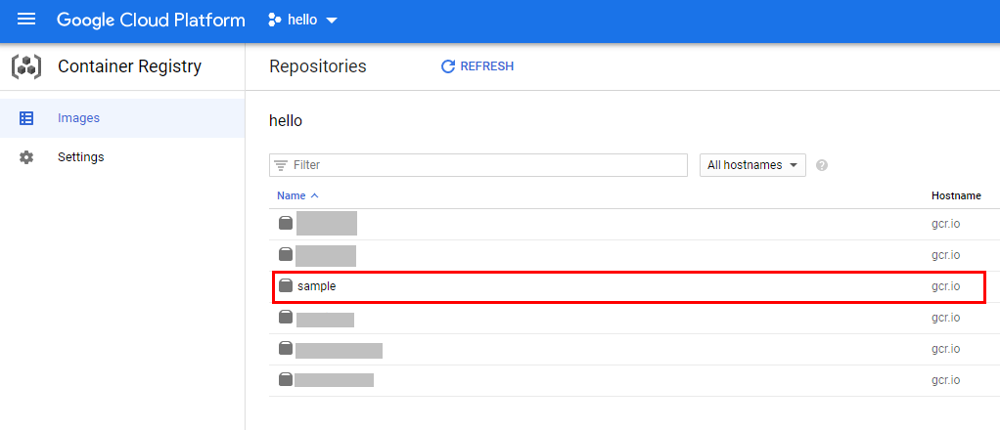
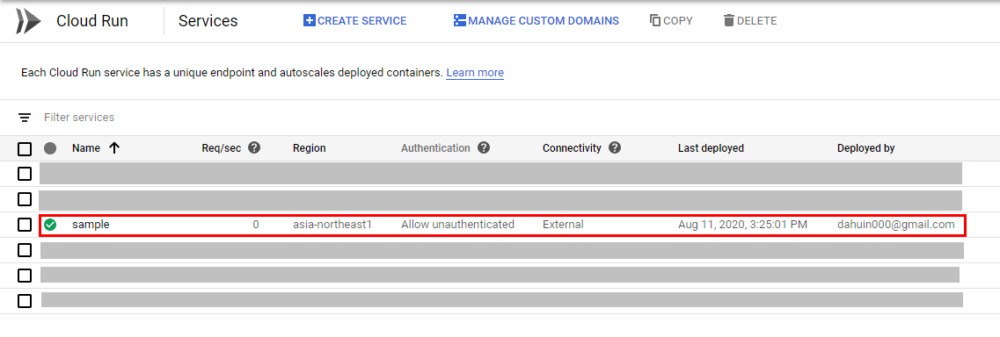

<p align="center">
  <a href="" rel="noopener">
 </a>
 <br>

 
</p>

<h3 align="center">Easy CloudRun</h3>

<div align="center">

[]()
[](https://github.com/da-huin/easy_cloudrun/issues)
[](https://github.com/da-huin/easy_cloudrun/pulls)
[](/LICENSE)

</div>

---

<p align="center"> GCP Cloud Run 을 사용 할 때 테스트, 빌드, 배포, GCP 이미지 삭제 등을 간단하게 해주는 패키지입니다.
    <br> 
</p>

## 📝 Table of Contents

- [About](#about)
- [Getting Started](#getting_started)
- [References](#references)
- [Usage](#usage)
- [Acknowledgments](#acknowledgement)

## 🧐 About <a name = "about"></a>

GCloud 로 배포하려면 GCR 에 배포 한 뒤 Cloud Run 에 배포해야하며, 배포 매개변수를 매번 설정해주어야 하는 문제가 있습니다.

그 작업을 간단하게 하기 위하여 사용하기 쉽게 만들어진 패키지입니다.

아래의 함수들을 사용 할 수 있습니다.

* [run](#run)
* [build](#build)
* [build_push](#build_push)
* [build_push_deploy](#build_push_deploy)
* [push](#push)
* [deploy](#deploy)
* [rmi](#rmi)
* [run_cloud](#run_cloud)

## 🏁 Getting Started <a name = "getting_started"></a>

### Installing

```
pip install easy_cloudrun
```

<a name="prerequisites"></a>

### Prerequisites 

1. Docker 를 설치합니다.

    https://www.docker.com/

1. GCloud 를 설치합니다.

    https://cloud.google.com/sdk/docs/quickstarts?hl=ko
    
    1. gcloud 를 설치 후 아래의 명령어를 입력하여 초기화를 합니다.
    
        ```bash
        gcloud init
        ```

    1. 이메일을 선택합니다..

        Choose the account you would like to use to perform operations for this configuration
    
    1. 프로젝트를 선택합니다.
    
        Please enter numeric choice or text value (must exactly match list item)

    1. 기본 Region 을 선택합니다.

        Do you want to configure a default Compute Region and Zone? (Y/n)?

    1. 아래의 명령어로 Google Continaer Registry 에 접근 할 수 있도록 합니다.

        ```bash
        gcloud auth configure-docker
        ```

### 🚀 Tutorial

#### 1. 서비스 만들기

1. 서비스 폴더를 원하는 곳에 생성합니다.
    
1. 아래처럼 파일들(Dockerfile, app.py)을 생성합니다.

    ```
    만든_서비스_폴더/
        Dockerfile
        src/
            app.py
    ```

1. `만든_서비스_폴더/src/app.py` 파일에 아래의 코드를 입력합니다.

    ```python
    import os
    from flask import Flask, request

    app = Flask(__name__)

    @app.route("/", methods=['GET'])
    def main():
        return f"{os.environ['FRUIT']}"

    app.run(host='0.0.0.0', port=os.environ["PORT"])
    ```

1. `만든_서비스_폴더/src/Dockerfile` 에 아래의 코드를 입력합니다.

    ```Dockerfile
    FROM ubuntu:18.04

    RUN apt-get update -y
    RUN apt-get install python3 -y
    RUN apt-get install python3-pip -y

    RUN pip3 install --upgrade pip
    RUN pip3 install flask

    COPY ./src /app
    WORKDIR /app

    CMD python3 app.py
    ```

#### 2. 서비스를 로컬에서 실행해보기


1. 아래의 코드를 실행하여 핸들러를 초기화합니다.

    ```python
    import easy_cloudrun


    handler = easy_cloudrun.EasyCloudRun()

    print(handler)
    ```

1. 아래의 코드를 이용하여 서버를 로컬에서 실행해봅니다.

    ```python
    service_name = "sample"
    dockerfile_dir = "local_dir/services/sample"
    environ = {"FRUIT": "Cherry"}
    port = 3040

    handler.run(service_name, dockerfile_dir,environ=environ, port=3040)
    ```

    실행결과: 
    ```bash
    Building docker sample
    [Command] cd local_dir/services/sample&&docker build --tag gcr.io/hello-266101/sample .
    Sending build context to Docker daemon  3.584kB
    Step 1/9 : FROM ubuntu:18.04
    ---> 2eb2d388e1a2
    Step 2/9 : RUN apt-get update -y
    ---> Using cache
    ---> 9afa5d8f29f4

    ...    

    [Command] docker run --rm --network easy_cloudrun --name sample -p 3040:3040 -e FRUIT=Cherry -e HELLO=WORLD -e PORT=3040  gcr.io/hello-266101/sample
    * Serving Flask app "app" (lazy loading)
    * Environment: production
    * Running on http://0.0.0.0:3040/ (Press CTRL+C to quit)
    WARNING: This is a development server. Do not use it in a production deployment.
    Use a production WSGI server instead.
    * Debug mode: off    
    ```

1. 로컬에서 실행된 서버에 요청을 보내봅니다.

    ```python
    >>> import requests
    >>> requests.get("http://localhost:3040").text
    'Cherry'
    ```

#### 2. 서비스를 CloudRun 에 배포하기

1. 아래의 코드로 CloudRun 에 배포해보겠습니다.

    ```python
    service_name = "sample"
    dockerfile_dir = "local_dir/services/sample"
    environ = {"FRUIT": "Cherry", "HELLO": "WORLD"}

    commands = {
        "--memory": "2Gi",
        "--allow-unauthenticated": ""
    }

    handler.build_push_deploy(service_name, dockerfile_dir, environ=environ, commands=commands)
    ```

    실행결과:     
    ```bash
    Building docker sample
    [Command] cd local_dir/services/sample&&docker build --tag gcr.io/hello-266101/sample .
    Sending build context to Docker daemon  3.584kB
    Step 1/9 : FROM ubuntu:18.04
    ---> 2eb2d388e1a2
    Step 2/9 : RUN apt-get update -y
    ---> Using cache
    ---> 9afa5d8f29f4
    Step 3/9 : RUN apt-get install python3 -y    

    ...

    Creating Revision.....................................................................................................................done
    Routing traffic......done
    Done.
    Service [sample] revision [sample-00008-wox] has been deployed and is serving 100 percent of traffic at https://sample-y2i4cvxklq-an.a.run.app    
    ```

1. https://cloud.google.com/container-registry 에서 이미지가 배포가 되었는지 확인합니다.

    


1. https://cloud.google.com/run 에서 클라우드런 서비스가 배포되었는지 확인합니다. 그리고 클릭합니다.

    

1. 복사 버튼을 클릭하여 주소를 복사합니다.

    

1. 아래의 코드를 실행하여 요청이 보내지는지 확인해봅니다.

    ```python
    >>> import requests
    >>> requests.get("복사한_URL").text
    'Cherry'
    ```

1. 완료했습니다.

## ⛄ References

#### 🌱 --allow-unauthenticated 를 사용하지 않은 서비스에 요청을 보내고 싶은 경우

* 아래의 링크를 참조하세요.

* https://github.com/da-huin/cloud_requests

#### 🌱 도커 빌드가 너무 오래걸릴 경우

1. 아래처럼 어떤 도커의 기본이 되는 도커파일을 생성합니다.

    ```Dockerfile
    FROM ubuntu:18.04

    RUN apt-get update -y
    RUN apt-get install python3 -y
    RUN apt-get install python3-pip -y

    RUN cp /usr/share/zoneinfo/Asia/Seoul /etc/localtime
    RUN echo "Asia/Seoul" > /etc/timezone
    RUN pip3 install --upgrade pip
    RUN pip3 install Flask
    ```

1. 아래의 명령어로 배포합니다.

    ```python
    >>> handler.build_push(service_name, dockerfile_dir)
    ```

1. 만드려는 서비스 도커파일에 `FROM gcr.io/프로젝트_이름/위에서_배포한_도커파일_이름` 을 적고 배포합니다.

## 🎈 Usage <a name="usage"></a>

Please check [Prerequisites](#prerequisites) before starting `Usage`.

### 🌱 run <a name="run"></a>

도커를 로컬에서 실행 할 때 사용합니다.

**Parameters**

* `(required) service_name`: str
    
* `(required) dockerfile_dir`: str

    도커파일이 위치해있는 디렉토리 이름입니다.

* `environ`: dict (default = {})

    도커에 적용 할 환경변수 이름입니다.

* `port`: int (default = 8080)
    
    도커에 적용할 포트 이름입니다.

* `user_command`: str (default = "")

    docker run 명령어 이후에 사용 할 유저의 커스텀 커맨드입니다.

* `test`: bool (default = False)

    이 매개변수는 환경변수 `TEST` 를 `true` 로 바꿔줍니다. 다른 기능은 없습니다.

**Returns**

* `None`

### 🌱 build_push <a name="build_push"></a>

도커를 빌드하고 Google Continaer Registry 에 배포 할 때 사용합니다.

클라우드런에 배포하려면 GCR(Google Continaer Registry) 에 먼저 배포해야합니다.

클라우드런에 배포하지 않아도, 다른 도커의 기본이 되는 도커파일로 사용하고 싶을 때 이 함수를 사용합니다.

**Parameters**

* `(required) service_name`: str
    
* `(required) dockerfile_dir`: str

    도커파일이 위치해있는 디렉토리 이름입니다.

**Returns**

* `None`

### 🌱 build_push_deploy <a name="build_push"></a>

도커를 빌드하고 Google Continaer Registry 에 배포 한 후 Cloud Run 에 배포 할 때 사용합니다.

클라우드런에 배포하려면 GCR(Google Continaer Registry) 에 먼저 배포해야합니다.

**Parameters**

* `(required) service_name`: str
    
* `(required) dockerfile_dir`: str

    도커파일이 위치해있는 디렉토리 이름입니다.

* `environ`: dict (default = {})

    클라우드런에 배포할 도커의 환경변수입니다.

* `commands`: dict (default = {})
    
    gcloud run deploy 에서 사용하는 매개변수에 사용자가 추가하고싶은 매개변수입니다.

    예를들면 아래와 같이 사용 할 수 있습니다.

    ```python
    {
        "--memory": "2Gi",
        "--allow-unauthenticated": ""
    }    
    ```

    자세한 내용은 아래의 링크를 참조하세요.

    https://cloud.google.com/sdk/gcloud/reference/run/deploy


**Returns**

* `None`

### 🌱 build <a name="build"></a>

도커만 빌드 할 때 사용합니다.

**Parameters**

* `(required) service_name`: str
    
* `(required) dockerfile_dir`: str

    도커파일이 위치해있는 디렉토리 이름입니다.

**Returns**

* `None`

### 🌱 push <a name="push"></a>

빌드된 도커를 푸쉬 할 때 사용합니다.

**Parameters**

* `(required) service_name`: str

**Returns**

* `None`

### 🌱 deploy <a name="deploy"></a>

GCR에 배포된 도커를 Clodu Run 에 배포 할 때 사용합니다.

**Parameters**

* `(required) service_name`: str
    
* `environ`: dict (default = {})

    클라우드런에 배포할 도커의 환경변수입니다.

* `commands`: dict (default = {})
    
    gcloud run deploy 에서 사용하는 매개변수에 사용자가 추가하고싶은 매개변수입니다.

    예를들면 아래와 같이 사용 할 수 있습니다.

    ```python
    {
        "--memory": "2Gi",
        "--allow-unauthenticated": ""
    }    
    ```

    자세한 내용은 아래의 링크를 참조하세요.

    https://cloud.google.com/sdk/gcloud/reference/run/deploy
    
**Returns**

* `None`

### 🌱 rmi <a name="rmi"></a>

GCR 에 배포하면 계속 쌓이는데 이 이미지들을 서비스 이름만으로 한번에 제거 할 수 있게 도와주는 함수입니다.

**Parameters**

* `(required) service_name`: str
    
**Returns**

* `None`

**Examples**

```python
>>> service_name = "sample"
>>> handler.rmi(service_name)
```

실행결과
```bash
[Command] gcloud container images delete gcr.io/hello-266101/sample@sha256:cb0e44aacba8a5f59b4664418c968daf18aaadd5b98f423c2584c0996e89fd7f --force-delete-tags -q
Digests:
- gcr.io/hello-266101/sample@sha256:cb0e44aacba8a5f59b4664418c968daf18aaadd5b98f423c2584c0996e89fd7f
  Associated tags:
 - latest
Deleted [gcr.io/hello-266101/sample:latest].
Deleted [gcr.io/hello-266101/sample@sha256:cb0e44aacba8a5f59b4664418c968daf18aaadd5b98f423c2584c0996e89fd7f].
Deleted image sample in the cloud.
```

### 🌱 run_cloud <a name="run_cloud"></a>

클라우드에 올라가 있는 도커를 로컬에서 실행하고 싶을 때 사용하는 함수입니다.

**Parameters**

* `(required) service_name`: str
    
* `(required) dockerfile_dir`: str

    도커파일이 위치해있는 디렉토리 이름입니다.

* `environ`: dict (default = {})

    도커에 적용 할 환경변수 이름입니다.

* `port`: int (default = 8080)
    
    도커에 적용할 포트 이름입니다.

* `user_command`: str (default = "")

    docker run 명령어 이후에 사용 할 유저의 커스텀 커맨드입니다.

* `test`: bool (default = False)

    이 매개변수는 환경변수 `TEST` 를 `true` 로 바꿔줍니다. 다른 기능은 없습니다.

**Returns**

* `None`


## 🎉 Acknowledgements <a name = "acknowledgement"></a>

- Title icon made by [Freepik](https://www.flaticon.com/kr/authors/freepik).

- If you have a problem. please make [issue](https://github.com/da-huin/easy_cloudrun/issues).

- Please help develop this project 😀

- Thanks for reading 😄
